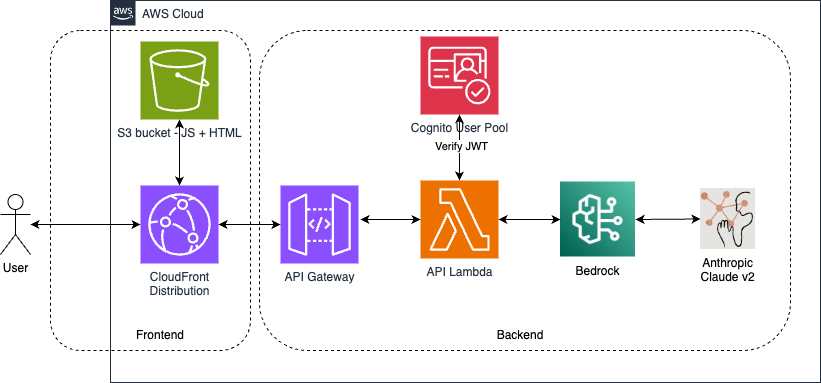
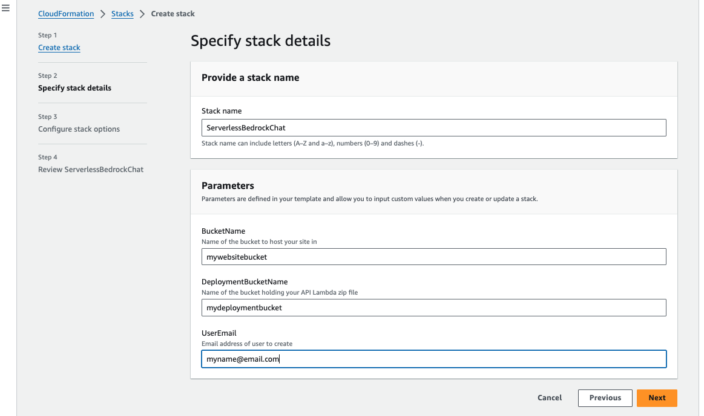
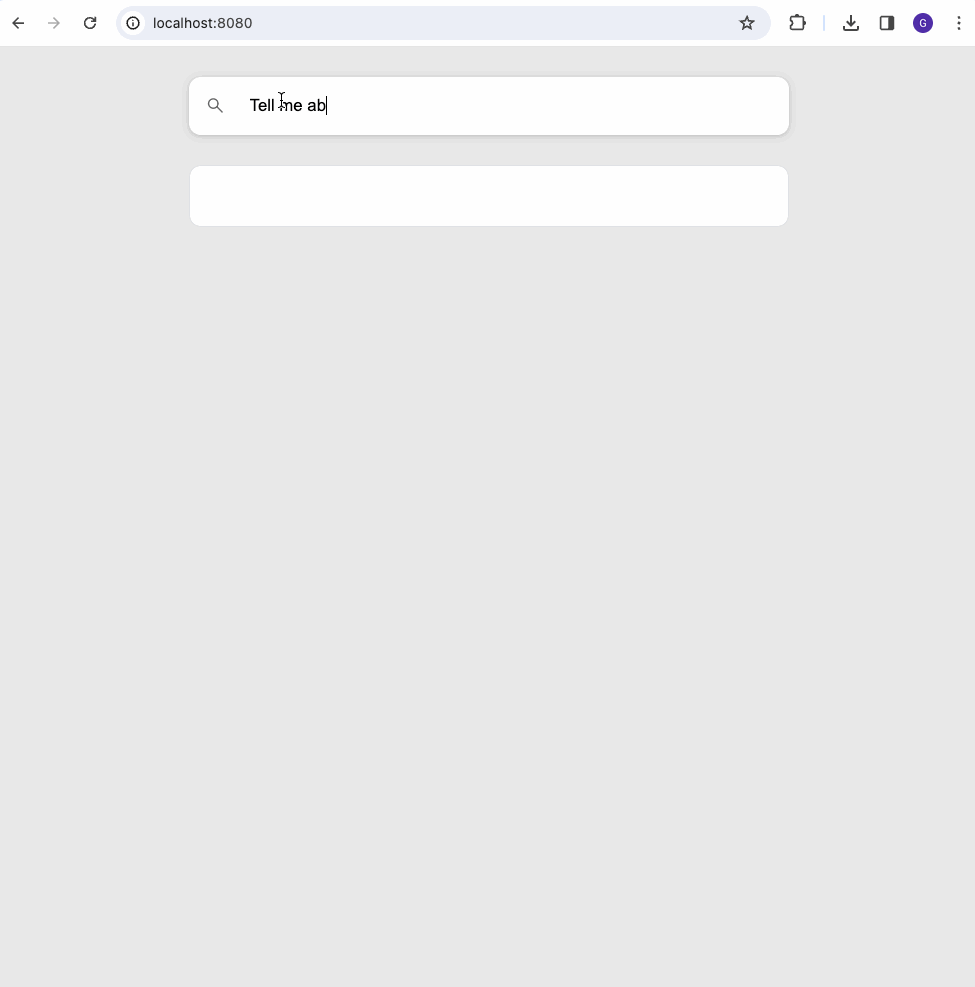

# Serverless Bedrock chat
A simple serverless web application demonstrating the use of Bedrock to interact with an LLM via a simple web chat interface. Both backend and
frontend are implemented with TypeScript.

The architecture of the application is illustrated below:-



## Backend
Before creating the insfrastructure via the Cloud Formation template, build the backend
Lambda code and place it in S3 for the Lambda deployment by following the steps below

### Create the bucket to hold the built Lambda code
First we create an S3 bucket to hold the deployable Lambda code (remember S3 bucket names are globally unique). To create this bucket, run the following command, where `BE_DEPLOYMENT_BUCKET` is a globally unique name for the bucket.

```
env BE_DEPLOYMENT_BUCKET=<bucket_name> ./backend/createDeploymentBucket.sh
```

### Build
We then transpile and webpack the backend Typescript code by running the following command
```
make build-backend
```

### Deploy
Finally we upload the built artifact by running the following command
```
 env BE_DEPLOYMENT_BUCKET=<bucket_name> make deploy-backend
```

## Infrastructure
Once we have the Lambda artifact built and ready to be deployed, we can deploy the supplied Cloud Formation template that will create all the required infrastructure (Lambda, API Gateway, S3 bucket, CloudFront distro, Cognito items etc.)

The CloudFormation template can be found in the project root directory and requires 3 parameters to be specified when deploying, as shown in the following screenshot



- BucketName - a globally unique name for an S3 bucket to host the static web application in
- DeploymentBucketName - the name of the S3 bucket that was created previously to hold the Lambda code
- UserEmail - a valid email address that will be used to create a Cognito user for the application, and send a confirmation mail to

### Cloudformation outputs
When the CloudFormation stack has successfully completed, navigate to the outputs and make a note of the following parameters that you will need to update in the frontend code before you build and deploy it.

- CognitoAppClientID - the app client id
- CognitoUserPoolID - the user pool id
- DomainName - the domain of the CloudFront distribution
- ServiceEndpointWebsocket - the addrewss of the API Gateway WebSocket

## Frontend

### Configure
Before building the frontend code, update the file `frontend/src/App.tsx` with the outputs from the CloudFormation stack in the previous step.

```
const USER_POOL_ID = ''; // Use CognitoUserPoolID output
const USER_POOL_WEB_CLIENT_ID = ''; // Use CognitoAppClientID output
const API_ENDPOINT = ''; // Use ServiceEndpointWebsocket output
```


### Build
To build the frontend code, run the following command from the project root directory.

```
make build-frontend
```

### Deploy
To deploy the frontend, run the following command from the project root directory. The `FE_DEPLOYMENT_BUCKET` is the name of the bucket provided when deploying the CloudFormation template in the previous step.

```
 env FE_DEPLOYMENT_BUCKET=<bucket_name> make deploy-frontend
```

### Use
Check your email for a welcome email from Cognito with a temporary password.

Then you can navidate to the CloudFront domain that was created by the CloudFormation stack, enter your email address and password and start to use the application.

