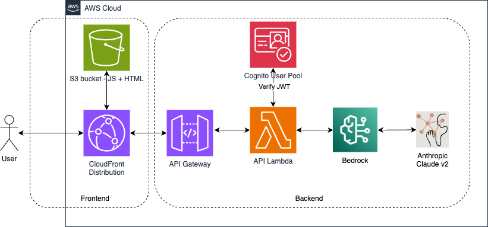

# Serverless Bedrock chat
A simple serverless web application demonstrating the use of Bedrock to interact with an LLM via a simple web chat interface. Both backend and
frontend are implemented with TypeScript.

The architecture of the application is illustrated below:-



## Backend
Before creating the insfrastructure via the Cloud Formation template, build the backend
Lambda code and place it in S3 for the Lambda deployment by following the steps below

### Create the bucket to hold the built Lambda code
First we create an S3 bucket to hold the deployable Lambda code (remember S3 bucket names are globally unique)

```
env BE_DEPLOYMENT_BUCKET=<bucket_name> ./backend/createDeploymentBucket.sh
```

### Build
We then transpile and webpack the backend Typescript code by running the following command
```
make build-backend
```

### Deploy
Finally we upload the built artifact by running the following command
```
 env BE_DEPLOYMENT_BUCKET=<bucket_name> make deploy-backend
```

## Infrastructure
Once we have the Lambda artifact built and ready to be deployed, we can deploy the supplied Cloud Formation template that will create all the required infrastructure (Lambda, API Gateway, S3 bucket, CloudFront distro, Cognito items etc.)


## Frontend

### Build
```
make build-frontend
```

### Deploy
```
 env FE_DEPLOYMENT_BUCKET=<bucket_name> make deploy-frontend
```